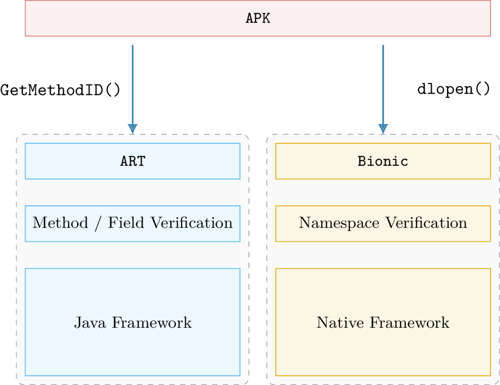

Android Runtime Restrictions Bypass
===================================

This repository contains work related to the Android restrictions bypass. It is about:

  * [Native library loading](https://developer.android.com/about/versions/nougat/android-7.0-changes#ndk)
  * [Internal framework access](https://developer.android.com/distribute/best-practices/develop/restrictions-non-sdk-interfaces)

   
 

----

You can find a detailed description in the [report.pdf](report.pdf) file and a PoC in [re.android.hiddenapi.apk](re.android.hiddenapi.apk). 

The application source code is also available but some files have been intentionally removed.
